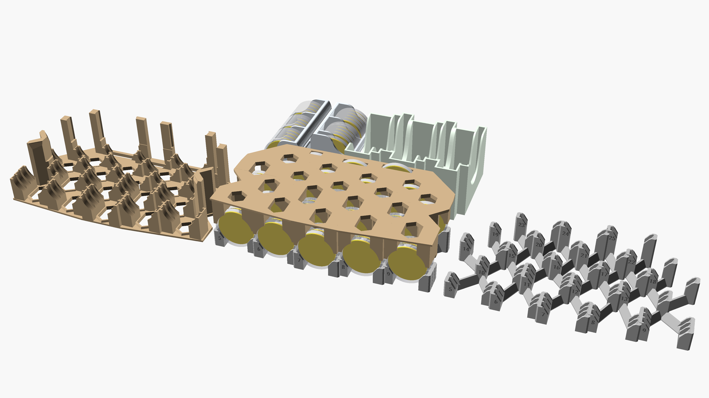
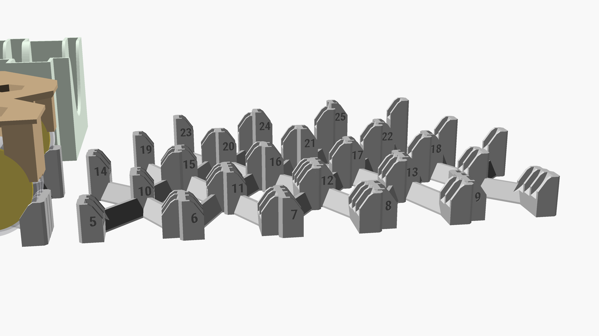

# Nidavellir Bank

3D printable inserts for the boardgame [Nidavellir](https://boardgamegeek.com/boardgame/293014/nidavellir), that work with coins in [protectors](https://www.amazon.de/gp/product/B07ZQJ1ZJJ/?th=1) and cards sleeved in Yucatan Narrow Card Game Sleeves (54x80mm).
It has sufficient space to fit [Nidavellir: Thingvellir](https://boardgamegeek.com/boardgameexpansion/326984/nidavellir-thingvellir).

## Imgs:

## .stl files:
- [Nidavellir-Bank](Nidavellir-Bank.stl)
- [Nidavellir-BankLid](Nidavellir-BankLid.stl)
- [Nidavellir-Cards](Nidavellir-Cards.stl)
- [Nidavellir-StartCoins](Nidavellir-StartCoins.stl)

